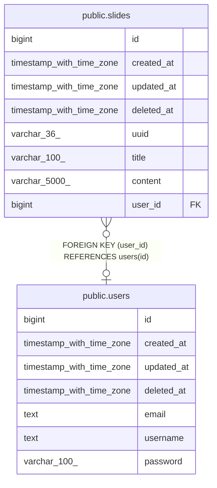

# database

## Tables

| Name                              | Columns | Comment | Type       |
| --------------------------------- | ------- | ------- | ---------- |
| [public.users](public.users.md)   | 7       |         | BASE TABLE |
| [public.slides](public.slides.md) | 8       |         | BASE TABLE |

## Relations

---

> Generated by [tbls](https://github.com/k1LoW/tbls)
