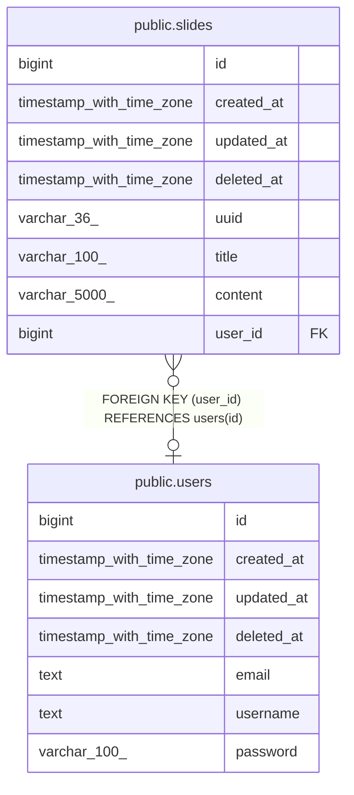

# public.users

## Description

## Columns

| Name       | Type                     | Default                           | Nullable | Children                          | Parents | Comment |
| ---------- | ------------------------ | --------------------------------- | -------- | --------------------------------- | ------- | ------- |
| id         | bigint                   | nextval('users_id_seq'::regclass) | false    | [public.slides](public.slides.md) |         |         |
| created_at | timestamp with time zone |                                   | true     |                                   |         |         |
| updated_at | timestamp with time zone |                                   | true     |                                   |         |         |
| deleted_at | timestamp with time zone |                                   | true     |                                   |         |         |
| email      | text                     |                                   | true     |                                   |         |         |
| username   | text                     |                                   | true     |                                   |         |         |
| password   | varchar(100)             |                                   | true     |                                   |         |         |

## Constraints

| Name       | Type        | Definition       |
| ---------- | ----------- | ---------------- |
| users_pkey | PRIMARY KEY | PRIMARY KEY (id) |

## Indexes

| Name                 | Definition                                                                 |
| -------------------- | -------------------------------------------------------------------------- |
| users_pkey           | CREATE UNIQUE INDEX users_pkey ON public.users USING btree (id)            |
| idx_users_deleted_at | CREATE INDEX idx_users_deleted_at ON public.users USING btree (deleted_at) |

## Relations

---

> Generated by [tbls](https://github.com/k1LoW/tbls)
